# 思源笔记高级表格增强功能分析与建议

本报告针对思源笔记（SiYuan）用户在操作表格时的实际场景与痛点进行深度解析，并针对现有高级表格插件（`siyuan-advanced-tables`）提出一系列具有高实用性与卓越体验的便利功能建议，供后续开发迭代参考。

---

## 1. 用户使用场景与痛点分析

在思源笔记中，表格（`NodeTable` 块）属于高频使用的内容载体，典型场景及核心痛点归纳如下：

| 用户使用场景 | 典型操作 | 核心痛点 (Pain Points) |
| :--- | :--- | :--- |
| **A. 数据录入与快速迁移** | 从 Excel / 网页复制参数对比表；<br>手写逗号/制表符隔开的草稿。 | 1. 直接粘贴格式极易错乱，常变成零散文本块；<br>2. 纯文本转为表格需繁琐地手动添加 `|`，效率极低。 |
| **B. 日常高频编辑与排版** | 阅读或填写长表格；<br>上下调换行/左右调换列。 | 2. **长表格向下滚动时，表头消失**，导致无法确认列属性，数据易填错；<br>3. 移动行列依赖快捷键，不如**鼠标拖动**直观。 |
| **C. 电子表格计算与统计** | 记录月度账单、记账、进度统计；<br>计算总和、平均值等。 | 1. 虽支持 GFM 公式（`TBLFM`），但**手写公式语法门槛过高**，非技术用户极难上手；<br>2. 缺少像 Excel 那样“划选区域自动求和”的即时反馈。 |
| **D. 数据检索与轻量过滤** | 在较长的任务看板、图书清单中筛选“进行中”或“特定类别”的行。 | 1. 思源原生表格不支持任何临时过滤，想看特定行只能全局搜索，但搜索会匹配到其他块；<br>2. 想要多维度排序需要借助外部工具。 |

---

## 2. 建议增强的便利功能设计

针对上述痛点，建议在后续里程碑中逐步引入以下便利功能，以打造“极致流畅”的思源表格编辑体验。

### 一、 智能导入与转换（解决“数据送入”痛点）

#### 1. 剪贴板智能粘贴（Excel/HTML 自动转换）
*   **功能描述**：当用户在表格块内（或空行处）粘贴时，插件自动识别剪贴板的 `text/html`（来自 Excel、Notion、飞书文档、网页等）。
*   **实现原理**：拦截 `paste` 事件，使用思源内置的 `lute` 转换器或轻量解析库，将 HTML 的 `<table>` 树直接重构为标准的 Markdown GFM 表格语法，并自动调用插件的 `format` 进行宽度平整。
*   **便利效果**：实现“即贴即用”，彻底告别从 Excel 复制到笔记后格式碎裂的尴尬。

#### 2. 选中文本一键转表格（Text to Table）
*   **功能描述**：允许用户选中多行以特定符号（如逗号 `,`、空格、制表符 `\t` 或冒号）分隔的文本，右键或通过快捷命令一键转换为表格。
*   **交互设计**：
    1. 用户框选文本 → 唤起命令「高级表格：将选中文本转换为表格」。
    2. 弹出一个微型悬浮窗，让用户勾选/输入分隔符。
    3. 自动生成对应的表格并替换原文本块。

---

### 二、 编辑体验极致舒适化（解决“日常操作”痛点）

#### 3. 粘性表头（Sticky Header）
*   **功能描述**：在阅读或编辑行数较多的表格时，表头（第一行 `<thead>` 或第一行 `<tr>`）自动固定在编辑器视口顶部。
*   **实现原理**：
    当光标进入表格（或表格处于阅读视口内）时，利用 CSS 对该表格内的表头应用如下样式：
    ```css
    .protyle-wysiwyg table thead {
        position: sticky;
        top: 48px; /* 避开思源顶部悬浮工具栏 */
        z-index: 10;
        background-color: var(--b3-theme-background); /* 保持背景不透明 */
        box-shadow: 0 1px 0 var(--b3-theme-border);
    }
    ```
*   **便利效果**：无论表格有多长，向下滚动时表头始终清晰可见，极大方便了长数据的比对和补录。

#### 
#### 5. 拖拽式行列重排（Drag & Drop Reorder）
*   **功能描述**：通过鼠标拖拽直接调换两行或两列的顺序，而不需要频繁点击“向上移动”或使用快捷键。
*   **交互设计**：
    *   当光标定位在表格内时，在当前行左侧 and 当前列上方显示微小的**拖拽手柄**。
    *   按住手柄拖动，显示目标位置的蓝色指示线，松开鼠标后自动重排 Markdown 文本并 flush 写入。

---

### 三、 电子表格公式与计算可视化（解决“数据统计”痛点）

#### 6. 可视化公式面板（Formula Helper）
*   **功能描述**：提供一个无需手写语法的公式插入与求值面板。
*   **交互设计**：
    1. 在浮动工具栏上新增「计算/公式」按钮。
    2. 点击后，显示常用快捷操作（例如：“在底部插入求和行”、“在右侧插入均值列”）。
    3. 支持**区域选框**：点击面板中的“选择范围”，然后在表格中用鼠标框选若干单元格，插件自动在后台生成类似 `<!-- TBLFM: $3=sum($1..$2) -->` 的 TBLFM 语句，并自动计算更新。
*   **便利效果**：将原本黑客化的“公式”功能平民化，极大地拓展了笔记内记账、做表的应用场景。

#### 7. 单元格选区即时计算（Status Bar Quick Calc）
*   **功能描述**：当用户在表格中选中多个数值单元格时，底部的状态栏或浮动工具栏旁实时显示这些单元格的 `Sum`（求和）、`Average`（平均值）、`Count`（计数）等基本统计信息。
*   **便利效果**：类似于 Excel 右下角的状态栏，免去为了临时算个数还要去写公式的麻烦。

---

### 四、 数据浏览与分析（解决“大表痛点”）

#### 8. 轻量级视图过滤器（Column Table Filter）
*   **功能描述**：在表头行下方显示过滤按钮。点击后可对各列的数据进行临时隐藏过滤（如只看状态为“待办”的行，或只看金额大于 100 的行）。
*   **实现原理**：
    *   属于“只读/纯渲染”功能，不破坏底层的 Markdown 纯文本。
    *   在表格的行 DOM 上，根据过滤条件，动态添加 `display: none;` 或特定的 CSS 类。
*   **便利效果**：在不改变数据结构的前提下，使表格具有轻量级的数据筛选能力，极适合把表格当做简易待办列表或知识库的用户。

#### 9. 一键数据图表化（Table to Chart）
*   **功能描述**：基于表格的数据，一键在表格下方自动生成思源的原生图表块（Mermaid / ECharts）。
*   **便利效果**：省去手写 ECharts 配置的烦恼，使学术研究、工作汇报、月度总结中的数据能立刻以柱状图、折线图等直观呈现。

---

## 3. 功能开发优先级建议

为了合理评估开发资源与用户价值，建议将上述功能划分为以下三个阶段进行规划：

```mermaid
gantt
    title 表格插件增强功能路线图
    dateFormat  X
    axisFormat %d

    section 核心体验 (已完成)
    粘性表头 (Sticky Header)   :active, des1, 0, 10
    剪贴板智能粘贴 (Excel/HTML) :active, des2, 0, 15
    单元格选区即时计算          :active, des3, 10, 20

    section 编辑增强 (已完成)
    选中文本一键转表格          :active, des4, 15, 25
    拖拽式行列重排 (D&D)        :active, des5, 20, 35

    section 高级特性 (未开始)
    可视化公式面板 (Formula Helper) :des6, 25, 45
    轻量级视图过滤器            :des8, 35, 55
```



1.  **第一阶段（核心体验优化，已全部完成）**：
    *   **[已完成] 粘性表头 (Sticky Header)**：通过 CSS 全局注入，在长表格滚动时，表头单元格自动固定在编辑区顶部，背景不透明且不遮挡输入。
    *   **[已完成] 剪贴板智能粘贴**：拦截粘贴事件。支持将 Excel/网页的 HTML 表格或 TSV 纯文本转换为表格数据，并覆盖到光标处；若在空行粘贴，一键转换为完整的思源表格。支持在粘贴时对原表格自动扩展行/列。
    *   **[已完成] 单元格选区即时计算**：按住 Alt 键在表格中鼠标划选任意矩形区域的单元格，底部悬浮状态栏自动显示选中单元格数、包含数值的个数、求和（Sum）、平均值（Average）。
2.  **第二阶段（日常操作增强，已全部完成）**：
    *   **[已完成] 文本一键转表格**：在任何非表格的段落文本中触发“文本转为表格”命令，弹窗让用户选择逗号、制表符、空格或自定义的分隔符，提供转换后的实时渲染预览，确认后将整块一键转换为思源表格。
    *   **[已完成] 拖拽行列重排**：光标聚焦在表格内时，自动在活动行左侧和活动列上方定位绝对定位的拖拽手柄（避免污染思源 DOM），鼠标拖动时在缝隙实时显示蓝色指示线，释放后在内存行模型中瞬间调换顺序并 flush 回写。
3.  **第三阶段（专业级特性，规划中）**：
    *   **可视化公式面板**：解决原生高级表格的硬核局限，但需要解决精细的 DOM 控制与 Markdown 转换边界问题。

---
> [!TIP]
> 针对 **粘性表头 (Sticky Header)** 功能，无需更改思源内核。我们可以在插件的样式文件中预置选择器，或在插件加载时动态注入全局 CSS，确保使用体验与思源原生主题无缝融合。

